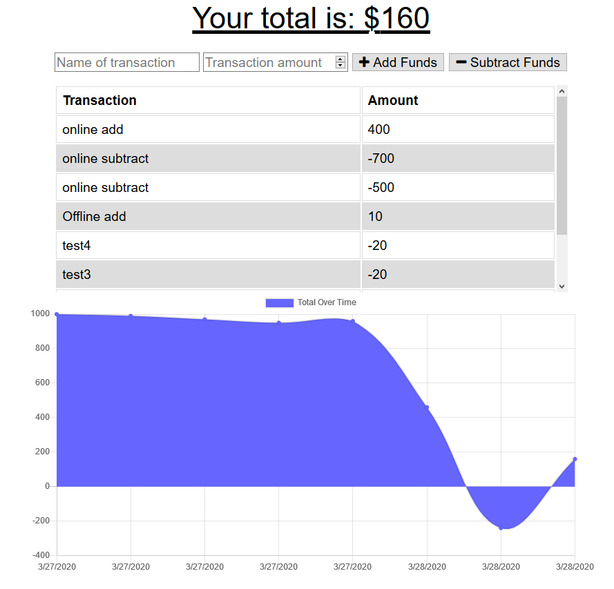
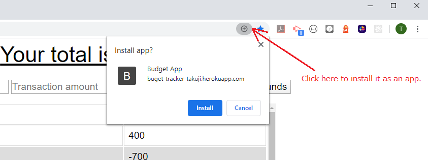
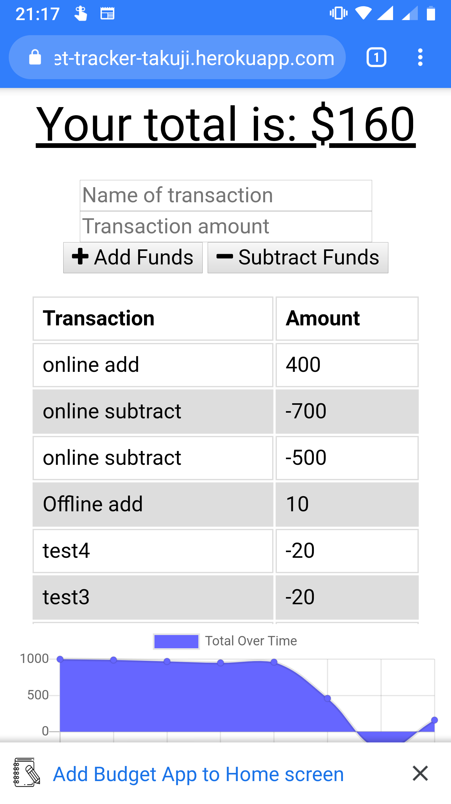

# Online/Offline Budget Trackers :chart:

This is a Budget Tracker application which allows for offline access. A user is able to add expenses and deposits to their budget with or without a connection. When entering transactions offline, they should populate the total when brought back online.

## Live Demo
https://buget-tracker-takuji.herokuapp.com/

## Functionalities

Offline Functionality:
* Enter deposits offline
* Enter expenses offline

When brought back online:
* Offline entries is added to tracker.

The Progressive Web Application technology makes a webpage installable as an app. This makes app available even when it's offline. The data is stored in IndexedDB on browser which can be used even when it is offline. Data is transferred to mongoDB on server side when it becomes online.

## Progress Web Application
 
 <i>"Progressive Web Apps provide an installable, app-like experience on desktop and mobile that are built and delivered directly via the web. They're web apps that are fast and reliable. And most importantly, they're web apps that work in any browser." </i>

https://codelabs.developers.google.com/codelabs/your-first-pwapp
 
 
On a computer. 
1. Open webpage by Chrome. 
2. Once webpage is open, click + icon to install it as an app. 

3. The app can be used even when it's offline.  

On a mobile phone. 
1. Open webpage by Chrome. 
2. Once webpage is open, the browser will ask if you want to install it. 

3. The icon is created on home screen. This can be used even when it's offline.

## Setup
1.	Ensure MongoDB and node.js are installed. 
2.	Install node.js libraries. 

`$ npm install`

3.	Start server.

`$ node server.js` 
      
4.	Open it by a web browser. 

## Technologies used
* Frontend: HTML, CSS, JavaScript, [IndexedDB](https://developers.google.com/web/ilt/pwa/working-with-indexeddb), PWA
* Backend: [Node.js](https://nodejs.org), [Express](https://expressjs.com/), [Mongoose](https://mongoosejs.com/), [MongoDB](https://www.mongodb.com/)

 
##  Credit 
I have implemented PWA and indexedDB support using code provided for course material as a base. 
